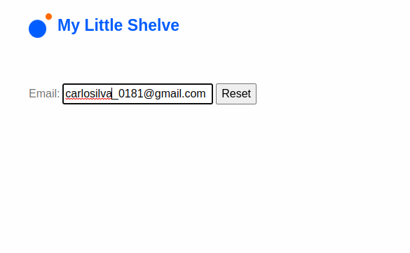
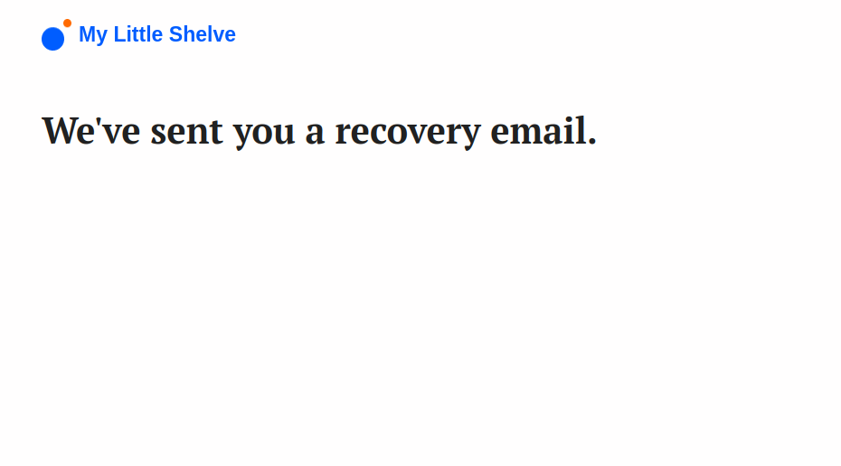
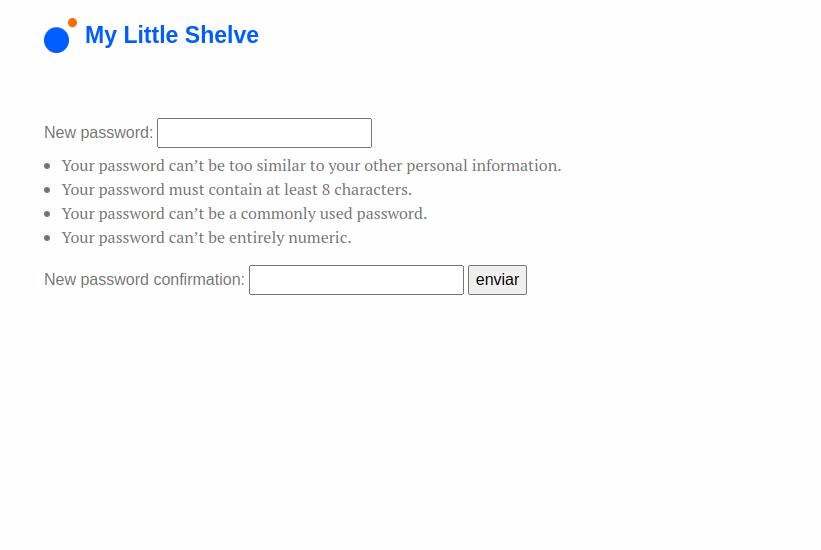
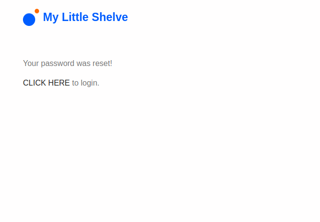

# Little Shelve 📚

A complete book sharing system for kids.

## Main idea

#### This project remains on a complete book management system which allows registered users to share them books with each other in a secure environment.

## Features
1. Built in Python (Django). 🐍
2. Authentication access control. 🔐
3. Mobile-first front-end oriented. 📱
4. Cache optimizing and use of indexes to speed up queries. ⏩
5. Google Books API on ISBN code search. 😀

## Technologies Used:
- Python
- Django
- Docker / Docker-Compose
- Postgres SQL
- Bootstrap
- JavaScript
    
## Highlights:

#### Book slider on Home screen

#### Home screen shows a fluid navigation thanks to Bootstrap nav-bar.
#### Search bar is easy to use and provide a wide search to quickly find books, users or authors.
#### Also has a notification sign upside to show user when someone ask for a book sharing request. 

**Book sharing requests are easy to made and provide to users a clear management system to take care of lended books.**

#### To register a new book, user can take advantage of **Google Books API** to search book details.

#### Authentication system implements a strong password validation and a complete recovery password cycle.

## Installation

To get it running on a linux server, launch the commands bellow:

    git clone https://github.com/Gabriel-Nunes/little_shelve.git
    cd little_shelve/
    sudo chmod +x run_dev.sh install.sh
    ./install.sh

## .env file:

Paste the following content in a file named as ".env" and place it on projects root folder (same as "manage.py").

    SECRET_KEY=$DJANGOSECRETKEY
    DEBUG=True
    PWPOSTGRES=postgres
    POSTGRES_NAME=postgres
    POSTGRES_USER=postgres

As the system is running in a docker container you should be included in "docker" group:
    
    sudo usermod -aG docker $USER

Finally, reboot your system, go to the project directory and run:

    docker-compose build web (only the 1st time)
    ./run_dev.sh

Your books sharing system is suposed to be running on 0.0.0.0:8000.

>>>>>>> #### Have fun! 🤓
